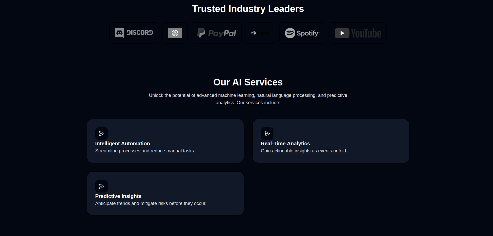
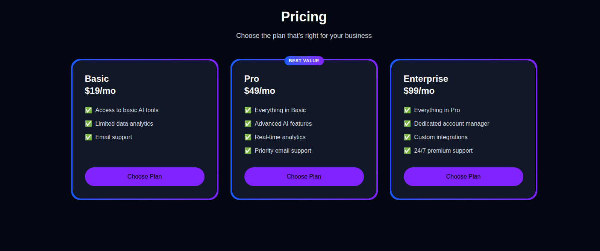

# Landing Page

A modern, responsive landing page built with TypeScript, CSS, JavaScript, and HTML.

🔗 **Live Preview:** [https://amirznbz.github.io/apple_website/](https://amirznbz.github.io/LANDING-PAGE/)

## Features

- Responsive design for all devices
- Clean and modern user interface
- Easy customization
- Fast loading

## Technologies Used

- CSS
- HTML
- TypeScript
- JavaScript

- Node.js and npm installed

### Installation

```bash
git clone https://github.com/AmirZNBZ/LANDING-PAGE.git
cd LANDING-PAGE
npm install
```

### Running Locally

```bash
npm start
```

Open [http://localhost:5173](http://localhost:5173) to view it in your browser.

## Folder Structure

```
├── public
├── src
│   ├── components
│   ├── styles
│   └── ...
├── package.json
└── ...
```

## Customization

- Update content and styles in the `src` directory as needed.
- Modify images and assets in the `public` folder.

## Deployment

You can deploy this landing page with services like Vercel, Netlify, or GitHub Pages.

## ✍️ Author

Made with ❤️

---

## License

This project is licensed under the [MIT License](LICENSE).





